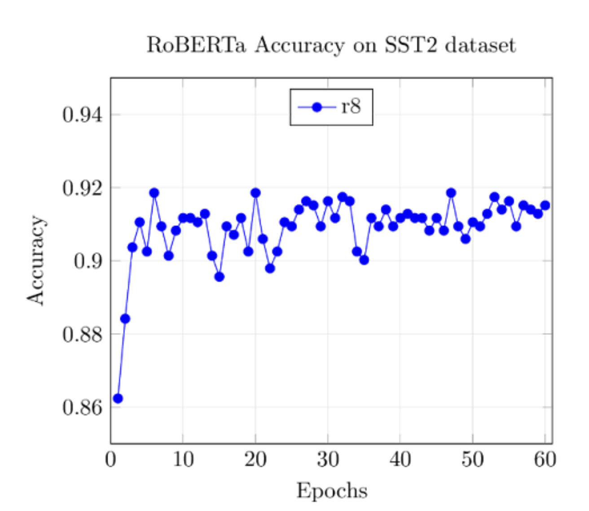

# Reproduction of LoRA: Parameter Efficient Finetuning for NLP Tasks

## Introduction
The goal of this project to is to reproduce the results presented in a research paper. We choose to reproduce "LoRA: Low Rank Adaptation of Large Language Models" [4].

This paper proposes freezing pre-trained weights and injecting low-rank matrices which are trained instead of updating all pre-trained weights. This technique drastically reduces trainable parameters, adds no inference latency, and remains compatible with standard Transformer architectures without sacrificing performance.

## Chosen Result
We fine-tune RoBERTa-base on the sentence pair classification tasks MRPC (paraphrase identification) and RTE (textual entailment identification), and DeBERTa-v2-xlarge on SST-2 (binary sentiment classification) with and without LoRA.

## GitHub Contents
This repository is organized in several aptly named directories. Here's a note about the most important code files:

* /code
  - berta_glue_pipeline.py : Script which supports fine-tuning of RoBERTa and DeBERTa models on GLUE tasks. Command line arguments control experiment configurations.
  - lora_layers.py : Defines LoRA layer class which defines A, B matrices and forward pass. Also contains functions to inject LoRA into models.
  - train_val_berta.py : Contains shared train and validation loops for BERTa style models.
  - roberta_lora and deberta_lora.py : Script to run experiments for respective model with configurations defined in [4].

## Re-Implementation Details
All models are modified and trained using PyTorch and Hugging Face Transformers and evaluated by accuracy score. When applying LoRA, we  freeze all parameters then replace key, query projection layers in the self-attention modules by a LoRA layer. The forward pass for the LoRA model is defined as $h = W_0x + BAx$.

## Reproduction Steps
Follow the following steps to reproduce our results. In order for efficient training, you will need GPU (CUDA).
1. Make sure you are in the root directory of the repo. Set up virtual environment:
```
python -m venv venv
source venv/bin/activate
pip install -r requirements.txt
```
2. Run GLUE task of choice (e.g. `mrpc`) on `roberta-base` (or `microsoft/deberta-base-v2-xlarge`) by running script `code/berta_glue_pipeline.py`. You can change default values for hyperparameters such as batch-size using command line arguments. Remove ``--lora True`` to run full fine-tuning of model.
```
cd code/
python3 berta_glue_pipeline.py --model-name="roberta-base" --task-name="mrpc" --lora True
```

## Results/Insights
In Table 2, the paper cites a peak accuracy of 95.1% when fine-tuning RoBERTa-base on SST-2 task with hyperparameters given in Table 10 of Appendix D. In our reproduction, we reached a best SST-2 accuracy of 91.8% with rank 8—falling slightly short of the original but still supporting the core insight that LoRA performs competitively with full fine-tuning while using far fewer parameters. For more results, see `report/LoRA_2page_report.pdf`.



## Conclusion
We learned that LoRA rank makes a huge impact the performance of models. From our results, we can conclude that certain LoRA configuration parameters may match the performance of full fine tuning at the lower cost of memory and training time.

## References
[1] He, Pengcheng, et al. "Deberta: Decoding-enhanced bert with disentangled attention." arXiv preprint arXiv:2006.03654 (2020).

[2] Hu, Edward J., et al. "Lora: Low-rank adaptation of large language models." ICLR 1.2 (2022): 3.

[3] Liu, Yinhan, et al. "Roberta: A robustly optimized bert pretraining approach." arXiv preprint arXiv:1907.11692 (2019).

[4] Wang, Alex, et al. "GLUE: A multi-task benchmark and analysis platform for natural language understanding." arXiv preprint arXiv:1804.07461 (2018).

## Acknowledgements
This project was undertaken for the final course project in CS 4782: Introduction to Deep Learning at Cornell University in Spring 2025. This work was presented at a poster session on May 1st, 2025. The members of this team project are Deniz Bölöni-Turgut, Audrey Wang, Tony Chen, and Allison Avila.